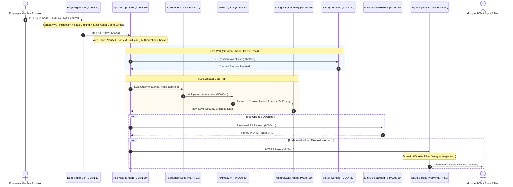

# Network Traffic Flow & Firewall Matrix

This document defines the strict, audited cross-tier traffic rules per Section 3 of `PRODUCTION_INFRA_REFERENCE.md`.

### Complete Cross-VLAN Firewall Allow Matrix

| Rule ID | Source Tier | Destination Tier | Destination Port | Protocol | Service / Purpose |
|---|---|---|---|---|---|
| **FW-01** | Any / Internet | Edge VIP (DMZ) | `443/tcp` | TCP | Employee Web & Mobile API Access |
| **FW-02** | Any / Internet | Edge VIP (DMZ) | `80/tcp` | TCP | Immediate HTTP to HTTPS Redirect |
| **FW-03** | Edge (DMZ) | App Tier (APP) | `3000/tcp` | TCP | Next.js Standalone Reverse Proxy |
| **FW-04** | App / Worker | PgBouncer Local | `6432/tcp` | TCP | High-performance Connection Pooling |
| **FW-05** | PgBouncer (APP) | HAProxy VIP (DATA) | `5000/tcp` | TCP | PostgreSQL Primary Read-Write Traffic |
| **FW-06** | PgBouncer (APP) | HAProxy VIP (DATA) | `5001/tcp` | TCP | PostgreSQL Standby Read-Only Traffic |
| **FW-07** | HAProxy (DATA) | PostgreSQL Nodes | `5432/tcp` | TCP | Direct PostgreSQL Backend Connection |
| **FW-08** | HAProxy (DATA) | PostgreSQL Nodes | `8008/tcp` | TCP | Patroni REST API Health Check (`/primary`, `/replica`) |
| **FW-09** | PostgreSQL Nodes | PostgreSQL Nodes | `5432/tcp` | TCP | Streaming Physical WAL Replication |
| **FW-10** | PostgreSQL Nodes | etcd Cluster | `2379/tcp` | TCP | Patroni Distributed Consensus (DCS) Lease |
| **FW-11** | etcd Nodes | etcd Nodes | `2380/tcp` | TCP | etcd Raft Peer Replication |
| **FW-12** | App / Worker | Valkey Cluster | `6379/tcp` | TCP | Redis-compatible Cache & BullMQ Queues |
| **FW-13** | App / Worker | Valkey Sentinels | `26379/tcp` | TCP | Sentinel Master Health & Topology Discovery |
| **FW-14** | App / Worker | Object Storage | `9000/tcp` | TCP | S3 Storage (Documents, Selfies, Payslips) |
| **FW-15** | App / Worker | OpenBao Vault | `8200/tcp` | TCP | Secrets, Token Decryption, AppRole Auth |
| **FW-16** | Standby PG Node | Backup Server | `pgBackRest TLS` | TCP | Dedicated Continuous WAL Archiving |
| **FW-17** | Backup Server | Offsite Target | `443/tcp` / SSH | TCP | Offsite Encrypted Mirroring (Client-side AES-256) |
| **FW-18** | App / Worker | Egress Proxy (MGMT)| `3128/tcp` | TCP | Whitelisted Outbound Forward Proxy |
| **FW-19** | Egress Proxy | External Services | `443, 587/tcp` | TCP | Outbound FCM, APNs, Attestation, SMTP Relay |
| **FW-20** | Bastion (MGMT) | All Server Nodes | `22/tcp` | TCP | Out-of-band SSH Administration (Key only) |
| **FW-21** | Prometheus (MGMT)| All Nodes | `9100-9187/tcp` | TCP | Prometheus Metrics Exporter Scrapes |
| **FW-22** | All Nodes | Loki (MGMT) | `3100/tcp` | TCP | Promtail Structured Log Forwarding |

> **Default Rule:** Any packet not matching an explicit rule above is dropped immediately (`policy drop`). Direct access from Internet to DATA, BACKUP, or MGMT VLANs is physically and logically blocked.
