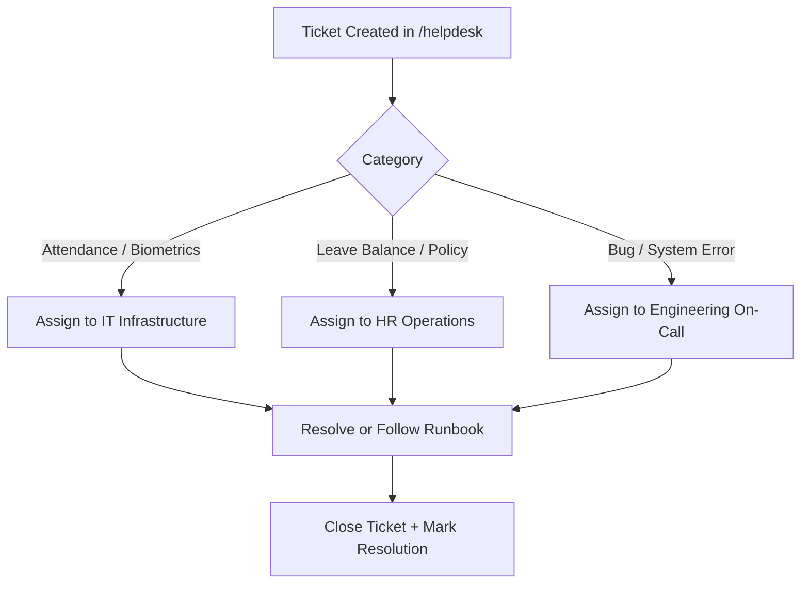

# Playbook: Pilot Support & Triage Operations

## 1. Overview
This playbook provides immediate tactical guidance for the HR Operations and IT Support staff supporting the Phase 3 Pilot. It guides how to diagnose common employee questions, handle biometric / mobile app punch issues, manage ticket routing in Helpdesk, and apply quick administrative fixes.

---

## 2. Common Pilot Issues & Standard Resolutions

### Issue 1: "Geofence Breach / Outside Office Location"
- **Employee Experience**: Mobile app punch fails with "Location outside configured geofence radius".
- **Root Causes**:
  - Employee's GPS accuracy is low (e.g., inside deep basement or concrete parking).
  - Work location GPS boundary radius is configured too strictly (e.g., 50m when 150m is needed for multi-acre campus).
- **Triage Steps**:
  1. Check GPS accuracy reported on punch attempt (`accuracyMeters > 30` indicates poor satellite fix).
  2. Ask employee to connect to office Wi-Fi to stabilize Assisted-GPS.
  3. If building has physical RF shielding, HR Admin can adjust Work Location radius in `/org/locations` from 50m to 150m.
  4. If urgent, employee can submit punch via Web portal with manager regularization.

### Issue 2: "Leave Application Blocked: Overlap or Sandwich Rule Violation"
- **Employee Experience**: Leave form displays error: "Leave dates conflict with an existing approved request" or "Sandwich policy converts intervening holiday/weekend to leave".
- **Triage Steps**:
  1. Review existing requests on the employee's calendar in `/leave`.
  2. Explain company policy regarding sandwich rules (e.g., Friday + Monday off causes Saturday & Sunday to be deducted per company leave policy).
  3. If an old pending request is locking dates, employee can withdraw or manager can reject it.

### Issue 3: "Biometric Turnstile Does Not Recognize Employee"
- **Employee Experience**: Fingerprint or face scanner beeps red at turnstile entrance.
- **Triage Steps**:
  1. Check device status in `/admin/devices`. If offline, follow `docs/runbooks/RUNBOOK_DEVICE_RESET.md`.
  2. Check employee status in `/employees`; ensure status is `active` and employee badge number matches biometric device enrollment ID.
  3. Advise employee to punch via Mobile App QR or Geofence until turnstile sync finishes.

### Issue 4: "Opening Leave Balances Incorrect After Migration"
- **Employee Experience**: Employee sees 0 or incorrect leave balance after migration from legacy HR software.
- **Triage Steps**:
  1. HR Operations checks batch status in `/migration` -> **Data Migration Batches**.
  2. If batch failed partially, download the **Error CSV**, correct row formatting, and re-upload.
  3. If individual correction is required, use `/leave/admin/adjust` to record an auditable adjustment.

---

## 3. Helpdesk Triage Workflow

---

## 4. Emergency Contacts & Escalation Roster

| Escalation Level | Role | Channel / Phone | Responsibilities |
| :--- | :--- | :--- | :--- |
| **Tier 1** | Floor HR Champions | Slack `#pilot-support-internal` | General app guidance, password resets, onboarding |
| **Tier 2** | HR Operations Lead | Slack `@hrops-leads` / Ext 4401 | Leave balance adjustments, policy overrides, shift changes |
| **Tier 3** | Systems & DB Engineer | PagerDuty `hrms-core-oncall` | Database locks, Redis latency, MinIO storage, worker crashes |
